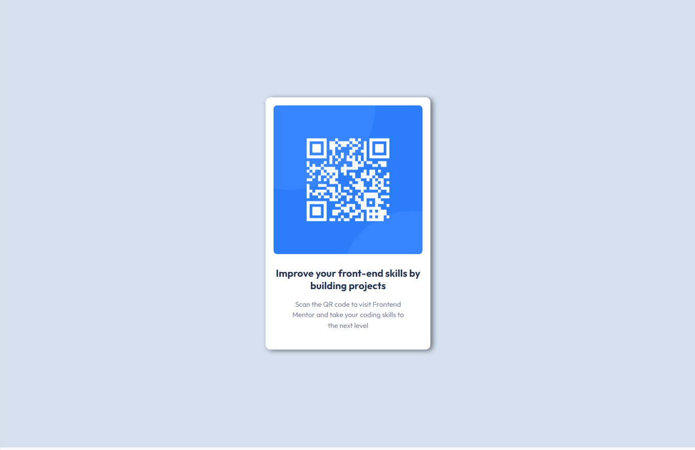
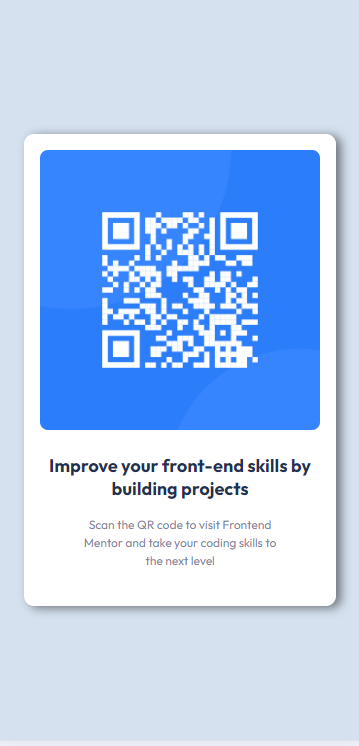

# Frontend Mentor - QR code component solution

This is a solution to the [QR code component challenge on Frontend Mentor](https://www.frontendmentor.io/challenges/qr-code-component-iux_sIO_H). Frontend Mentor challenges help you improve your coding skills by building realistic projects.

## Table of contents

- [Overview](#overview)
  - [Screenshot](#screenshot)
  - [Links](#links)
  - [Results](#results)
- [My process](#my-process)
  - [Built with](#built-with)
  - [What I learned](#what-i-learned)
  - [Continued development](#continued-development)
  - [Useful resources](#useful-resources)
- [Author](#author)
- [Acknowledgments](#acknowledgments)

## Overview

### Screenshot


### Links

- Solution URL: [View Solution](https://your-solution-url.com)
- Live Site URL: [View Live Site](https://your-live-site-url.com)

### Results

Here are the results of my work: 

- **Desktop**: 



- **Mobile**: 



## My process

### Built with

- Semantic HTML5 markup
- CSS custom properties
- Flexbox
- Mobile-first workflow
- Google Fonts (Outfit)

### What I learned

This project allowed me to practice the basics of **Flexbox** for aligning items both vertically and horizontally in a responsive way. I also improved my understanding of mobile-first design and learned how to make content adaptable for different screen sizes.

Here’s a snippet from my CSS that showcases how I used Flexbox:

```css
body {
    display: flex;
    justify-content: center;
    align-items: center;
    height: 100vh;
    background-color: #D5E1EF;
}
```
And this is an example of how I handled responsive design:

```css
@media (max-width: 375px) {
    .card {
        width: 90%;
        max-width: 280px;
        padding: 1rem;
    }
}
```

### Continued development
In future projects, I want to focus more on creating responsive components with better accessibility, as well as experimenting with CSS Grid for more complex layouts.

### Useful resources

- MDN Flexbox Guide - This is a great guide to understanding Flexbox.
- CSS Tricks Flexbox Guide - A comprehensive guide that helped me get the hang of Flexbox quickly.

### Author
- @Adrien-Hoyoux

### Acknowledgments
Thanks to Frontend Mentor for providing these great challenges to practice real-world coding skills!